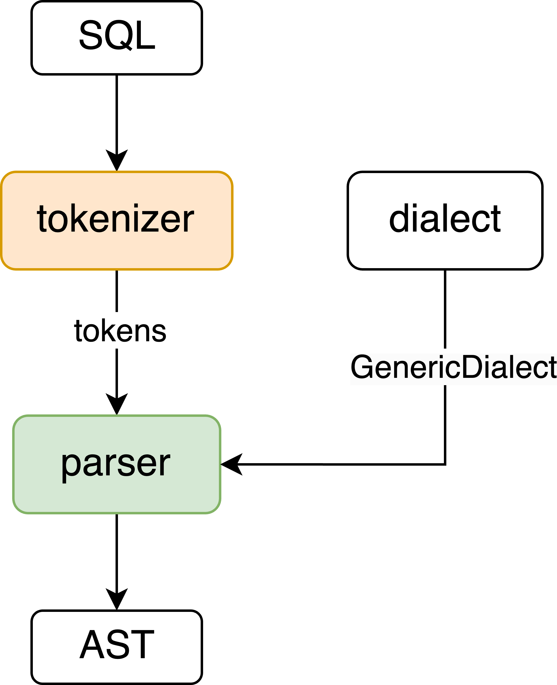
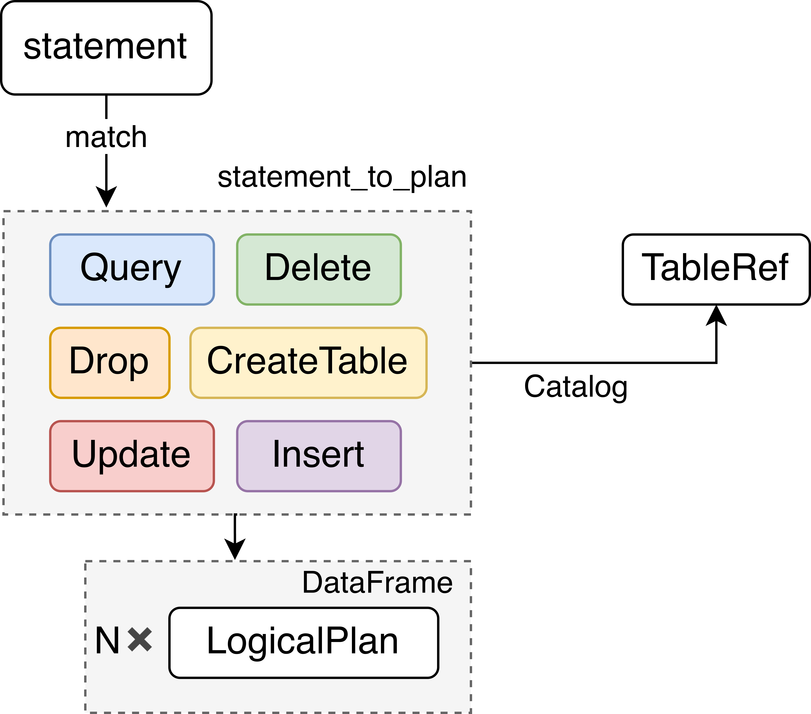
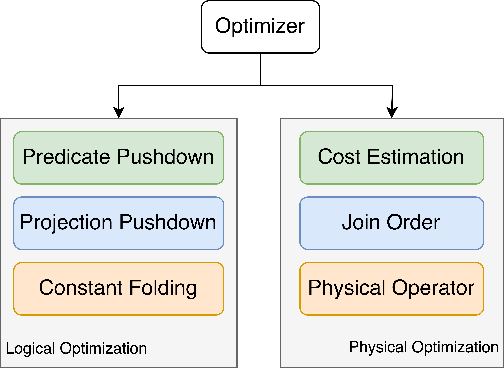

# 利用Rust实现一个支持SQL接口的查询引擎
在设计和开发数据库查询引擎时，选择合适的编程语言至关重要。传统上，C/C++凭借其高性能和底层控制能力被广泛应用于数据库系统的实现。然而，使用C/C++也带来了潜在的内存安全问题，这可能导致程序不稳定甚至系统崩溃。因此，为了提高开发效率和系统可靠性，Rust语言逐渐成为实现支持SQL接口的查询引擎的理想选择。
1. C/C++存在的内存问题

    使用C/C++编程需要手动管理内存，这为开发者提供了灵活性，但也容易引发以下常见问题：
    * **野指针（Wild Pointer）**：野指针是指向已被释放、未初始化或无效内存地址的指针变量。操作野指针可能导致程序崩溃或意外行为，难以调试。
    * **内存溢出（Overflow）**：内存溢出通常由越界访问数组或缓冲区引起。程序试图访问未分配的内存区域，可能破坏数据结构，甚至危害系统安全。
    * **内存泄漏（Memory Leak）**：当程序分配的内存未能及时释放时，会导致可用内存逐渐减少。长期运行的程序因此可能耗尽系统资源，降低性能或引发崩溃。这些问题不仅增加了调试和维护的复杂性，也对系统的稳定性和安全性构成威胁。
2. Rust的内存安全优势

    Rust作为一种系统级编程语言，以其独特的内存安全模型和强大的编译器功能，提供了一种更可靠的替代方案。Rust通过以下机制从语言层面解决了许多传统内存管理问题：
    * **所有权（Ownership）**：Rust的所有权机制是其内存管理的核心概念。每个内存块只能由一个变量拥有，当变量离开作用域时，内存会被自动释放。这种机制不仅避免了内存泄漏，也防止了双重释放等错误。
    * **借用（Borrowing）**：Rust通过借用机制允许内存被多个引用使用，但对引用的使用施加了严格的规则：不可变引用：多个引用可以同时访问，但不可修改数据。可变引用：同一时间内只能有一个可变引用，确保修改的安全性。这种严格的引用规则有效地防止了数据竞争和悬挂指针。
    * **编译时内存检查**：Rust的编译器在编译阶段对代码进行深入分析，将许多潜在的内存错误（如访问越界、空指针解引用等）捕获。这种设计虽然增加了编译时间和学习成本，但显著提高了代码的安全性和可靠性。
    * **编译时内存检查**：Rust内置的“无数据竞争”保障使其在处理并发任务时更加安全。通过编译时的线程安全检查，Rust允许开发者构建高效且安全的多线程程序，这是构建高性能查询引擎的重要能力。


## Architecture
1. Overview

    SimpleDB是利用Rust实现的支持SQL接口的查询引擎，主要有五个组成部分：
    * **Parser**：将用户输入的查询解析为AST，并通过TableRef 与Catalog 交互，解析表的信息；
    * **LogicalPlanner**：根据解析后的AST生成逻辑执行计划；
    * **Optimizer**：优化逻辑计划，生成更高效的执行计划；
    * **PhysicalPlanner**：将逻辑计划转换为物理计划，是查询的底层实现步骤，包含如何具体执行查询的细节；
    * **Executor**：根据物理计划执行查询，访问存储的数据并生成最终的结果集。


    
    ```rust
    impl SimpleDB {
        // 执行一个sql语句 返回结果/错误 这里来回移动所有权 会造成错误
        pub fn run_sql(&mut self, sql: &str) -> Result<Vec<RecordBatch>> {
            // 1. sql -> statement
            let statement1 = SQLParser::parse(sql)?;   // ? 表示遇到没定义的语句
            // 2. statement -> logical plan
            let sql_planner = SQLPlanner::new(&self.catalog); // 创建一个SQL查询计划，使用数据库的catalog来检查表和列的元数据
            let logical_plan = sql_planner.statement_to_plan(statement1)?;  // ? 表示statement无法解析成计划
            // println!("{:?}", logical_plan);    // 打印出逻辑计划
            // 3. optimize
            let optimizer = Optimizer::default();
            let logical_plan = optimizer.optimize(logical_plan); 
            // 4. logical plan -> physical plan
            let physical_plan = QueryPlanner::create_physical_plan(&logical_plan)?;
            // 5. execute
            physical_plan.execute();
        }
    }

    ```
2. Parser

    通过实现一个**SQLParser**类，集成可扩展的SQL词法分析器和解析器**sqlparser**实现将用户输入的SQL语句解析为AST。SimpleDB中选择使用通用的SQL方言dialect::GenericDialect，可根据不同的应用需求进行修改。

    
3. LogicalPlanner

    通过实现一个**SQLPlanner**类实现将解析器生成的statement转换为逻辑执行计划。SimpleDB中通过一个DataFrame结构体将多个逻辑计划组合在一起，不存在TableScan的实现，因为其通常是最底层的逻辑计划。

    
4. Optimizer

    Optimizer结构体表示一个查询优化器，包含一个 rules字段，用来存储所有应用的优化规则。通过OptimizerRule trait定义了优化规则的接口，每个规则需实现optimize方法，接受一个 LogicalPlan作为输入，并返回优化后的LogicalPlan。SimpleDB中目前只实现了Projection下推，将投影操作下推，即提前选择需要的列，减少中间结果的元组大小。
    

5. PhysicalPlanner

    通过实现一个QueryPlanner类，为每个逻辑操作生成相应的物理执行计划。通过递归调用create_physical_plan的方式，对不同类型的逻辑计划调用其在物理计划中的create函数生成对应的物理计划PhysicalPlanRef；注意在逻辑计划阶段处理得到的LogicalExpr需要通过create_physical_expression单独处理为PhysicalExprRef后，再与前面的物理计划进行合并。
    

## How to use SimpleDB
SimpleDB提供了支持SQL接口的交互式查询执行引擎，用户直接与SimpleDB交互，输入SQL查询，SimpleDB提供SQL查询接口，将用户的查询传递给后续的处理模块并输出查询结果。
1. main.rs
    ```rust
    fn run_sql_on_db(db_arc: Arc<Mutex<SimpleDB>>, sql: &str) -> Result<Vec<RecordBatch>> {
        let mut db = db_arc.lock().unwrap(); // 获取锁，修改 db
        db.run_sql(sql)
    }

    fn main() -> Result<()> {
        // 创建数据库
        let mut db = SimpleDB::default();
        println!("Welcome to Snow's SimpleDB!");
        // 初始化一个内存表t1和三个内存表employee、rank和department以及person、knows表
        db.create_csv_table("t1", "data/test_data.csv", CsvConfig::default())?;
        db.create_csv_table("person", "data/person.csv", CsvConfig::default())?;
        db.create_csv_table("knows", "data/knows.csv", CsvConfig::default())?;
        db.create_csv_table("employee", "data/employee.csv", CsvConfig::default())?;
        db.create_csv_table("rank", "data/rank.csv", CsvConfig::default())?;
        db.create_csv_table("department", "data/department.csv", CsvConfig::default())?;

        // 创建数据库的引用
        let db_arc = Arc::new(Mutex::new(db));
        // 进入一个命令行交互模式
        loop {
            // 提示用户输入 SQL 查询
            print!("Enter SQL query (or 'exit' to quit): ");
            io::stdout().flush()?; // 确保输出立即显示

            // 读取用户输入的查询
            let mut sql = String::new();
            io::stdin().read_line(&mut sql)?;

            // 去除末尾的换行符
            let sql = sql.trim();

            // 如果用户输入 "exit"，则退出程序
            if sql.to_lowercase() == "exit" {
                println!("Exiting the database system.");
                break;
            }

            // 执行查询并输出结果
            match run_sql_on_db(db_arc.clone(), sql) {
                Ok(result) => {
                    print_result(&result)?;
                }
                Err(e) => {
                    println!("Error executing query '{}': {:?}", sql, e);
                }
            }
        }

        Ok(())
    }
    ```
2. Output
    ```
    Welcome to Snow's SimpleDB!
    Enter SQL query (or 'exit' to quit): select count(id), sum(age), sum(score), avg(score), max(score), min(score) from t1 group by id % 3
    +-----------+----------+--------------------+-------------------+------------+------------+
    | count(id) | sum(age) | sum(score)         | avg(score)        | max(score) | min(score) |
    +-----------+----------+--------------------+-------------------+------------+------------+
    | 2         | 43       | 167.7              | 83.85             | 85.5       | 82.2       |
    | 3         | 61       | 255.6              | 85.2              | 90.1       | 81.1       |
    | 3         | 62       | 243.29000000000002 | 81.09666666666668 | 99.99      | 60         |
    +-----------+----------+--------------------+-------------------+------------+------------+
    Enter SQL query (or 'exit' to quit): select count(id), sum(age), sum(score), avg(score), max(score), min(score) from t1
    +-----------+----------+------------+------------+------------+------------+
    | count(id) | sum(age) | sum(score) | avg(score) | max(score) | min(score) |
    +-----------+----------+------------+------------+------------+------------+
    | 16        | 332      | 1333.18    | 83.32375   | 99.99      | 60         |
    +-----------+----------+------------+------------+------------+------------+
    Enter SQL query (or 'exit' to quit): select id, name, age + 100 from t1 where id < 9 limit 3 offset 2
    +-------+-------+-----------+
    | t1.id | name  | age + 100 |
    +-------+-------+-----------+
    | 4     | lynne | 118       |
    | 5     | alice | 119       |
    | 6     | bob   | 120       |
    +-------+-------+-----------+
    Enter SQL query (or 'exit' to quit): exit
    Exiting the database system.
    ```


## Future Work
1. SQL功能扩展
    - [ ] **更完整的SQL支持**：支持更多的SQL功能，如HAVING、ORDER BY、窗口函数、子查询等；
    - [ ] **复杂查询**：支持更多JOIN操作（如LEFT JOIN、RIGHT JOIN）、集合操作（UNION、INTERSECT、EXCEPT）等。
2. 查询优化
    - [ ] **实现更多的优化规则**：谓词下推、谓词合并、冗余谓词消除、常量折叠、连接重排序、提前聚合等；
    - [ ] **连接算法**：支持更多的连接，例如嵌套索引连接，根据数据分布，表的大小和索引情况等选择最合适的连接算法。
3. 持久化与存储引擎
    - [ ] **实现持久化存储引擎**：选择合适的数据存储结构，将数据存储到磁盘上，并支持高效的读写；
    - [ ] **缓存管理和内存映射**：将磁盘上的数据文件映射到内存中，直接通过内存来访问磁盘数据，减少读取磁盘的时间。
4. 事务支持
    - [ ] **事务日志和恢复机制**：确保事务的原子性、持久性和系统崩溃后的快速恢复，同时减少日志存储开销；
    - [ ] **并发控制**：利用MVCC和不同的事务隔离级别实现并发控制，提高事务吞吐量，同时确保数据一致性和事务隔离性。
## Conclusion
在本次课程项目中，我成功使用Rust实现了一个简单的SQL查询引擎。这一过程不仅帮助我完成了课程任务，还让我对Rust语言的核心理念和关键技术有了更深入的理解。我系统地学习了Rust的基本语法、数据结构以及其独特的语言特性，例如所有权模型、借用机制和类型系统的严格性。

通过这一实践，我深刻认识到Rust在构建高性能和可靠系统中的独特优势。Rust的内存管理模型为开发者提供了编译时的安全保障，有效避免了常见的内存错误，如空指针解引用和数据竞争。同时，Rust的所有权机制使内存分配和释放更加高效，从根本上杜绝了内存泄漏的风险。

此外，我对Rust在性能优化和并发处理方面的能力有了新的认识。在实现查询引擎的过程中，我发现Rust的零成本抽象和高效的运行时性能使其能够在保持开发效率的同时，实现接近底层语言的运行速度。而其线程安全的并发模型进一步确保了多线程操作的安全性，这对于现代数据库系统的设计尤为重要。

综上所述，本次课程项目不仅加深了我对Rust语言的掌握，也让我体验到了其在高性能、内存安全和并发编程方面的巨大潜力。这些特性在开发数据库查询引擎中发挥了关键作用，为构建更复杂和高效的系统奠定了基础。未来，我希望能进一步探索Rust在更大规模数据库系统开发中的应用，挑战更复杂的技术场景，并持续提升自己的编程能力和系统设计能力。